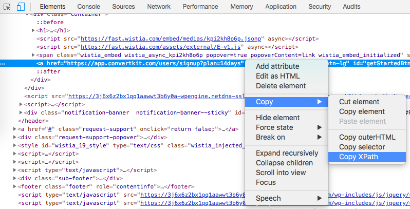
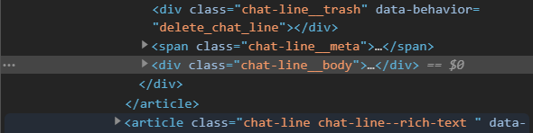

Frequently Asked Questions
=============================

How is TagUI licensed?
-------------------------
TagUI is a free, open-source, cross-platform software released under the Apache 2.0 license.

.. _find-xpath:

How do I find the XPath of a web element?
---------------------------------------------
In Chrome/Edge, right-click on the element, click Inspect, right-click on the highlighted HTML, then:

For some web pages, the XPath of an element can change. To combat this, you can find a stable element in the web page and writing a custom XPath relative to that stable element. 

XPath is very powerful and can allow you to select web elements in many ways. Learn more about XPath at `W3Schools <https://www.w3schools.com/xml/xpath_intro.asp>`_. Alternatively, check out `SelectorsHub Chrome extension <https://chrome.google.com/webstore/detail/selectorshub/ndgimibanhlabgdgjcpbbndiehljcpfh?hl=en>`_ tool.

.. _element_attributes:

How do I find the id, name, class or other attributes of a web element?
----------------------------------------------------------------------------
In Chrome/Edge, right-click on the element, click Inspect. There will be some highlighted HTML, like this:

This highlighted element has a ``class`` attribute of "chat-line__body". It doesn't have any ``id`` or ``name`` attribute

.. _how-to-use-command-prompt:

How do I use the Command Prompt?
----------------------------------------
Hold the Windows key and press R. Then type ``cmd`` and press Enter to enter the Command Prompt.

From here, you can run a command by typing it and pressing Enter.

.. _how-to-use-terminal:

How do I use the Terminal?
----------------------------------------
Hold Command and press spacebar, then type ``terminal`` and press Enter.

From here, you can run a command by typing it and pressing Enter.

.. _what-are-csv-files:

What are csv files?
-------------------------------------------------
CSV files are files which stores data in a table form. They can be opened with Microsoft Excel and Google Sheets. Each line is a row of values. The values are split into different columns by commas ``,``, which is why CSV stands for Comma Separated Values.

.. _run-on-schedule:

Running flows on a fixed schedule
--------------------------------------
It is often useful to run flows automatically on a fixed schedule: monthly, weekly, daily or even every 5 minutes.

On Windows, `use the Task Scheduler <https://www.digitalcitizen.life/how-create-task-basic-task-wizard>`_.

.. raw:: html

    <video playsinline autoplay muted loop width="100%">
        <source src="./_static/schedule-a-flow.mp4" type="video/mp4">
        Your browser does not support the video tag.
    </video>
|
On macOS / Linux, `use crontab command <https://www.ostechnix.com/a-beginners-guide-to-cron-jobs/>`_.

How do I kill any unfinished TagUI processes?
-----------------------------------------------
If you Ctrl+C to break a TagUI automation, you can use ``tagui/src/end_processes`` (for macOS / Linux) or ``end_processes.cmd`` (for Windows) to kill any dead processes of TagUI integrations (Chrome, Edge, SikuliX, Python etc).

Why doesn't TagUI work on zoom levels other than 100%?
-------------------------------------------------------------
TagUI mimics the user mouse-clicks at the (x,y) coordinates of web elements, so using a different zoom level for your web browser will cause clicks to be triggered at wrong coordinates. Make sure TagUI's Chrome/Edge browser is set to 100% zoom for best results. 

Is TagUI safe and secure to use?
--------------------------------
As TagUI and the foundation it's built on is open-source software, it means users can read the source code of TagUI and all its dependencies to check if there is a security flaw or malicious code. This is an advantage compared to using commercial software that is closed-source, as users cannot see what is the code behind the software.

Following are links to the source code for TagUI and its open-source dependencies. You can dig through the source code for the other open-source dependencies below, or make the fair assumption that security issues would have been spotted by users and fixed, as these projects are mature and have large user bases.

- TagUI - https://github.com/kelaberetiv/TagUI
- SikuliX - https://github.com/RaiMan/SikuliX1
- CasperJS - https://github.com/casperjs/casperjs
- PhantomJS - https://github.com/ariya/phantomjs
- SlimerJS - https://github.com/laurentj/slimerjs
- Python - https://github.com/python/cpython
- R - https://github.com/wch/r-source
- PHP - https://github.com/php/php-src

See this section on why TagUI has enterprise security by design - https://github.com/kelaberetiv/TagUI#enterprise-security-by-design

Does TagUI track what I automate?
---------------------------------------
No. TagUI does not send outgoing web traffic or outgoing data, other than what the user is automating on, for example visiting a website.

.. _visual-automation-troubleshooting:

Why doesn’t my visual automation work?
----------------------------------------
On macOS, it may be due to `how the image was captured <https://github.com/kelaberetiv/TagUI/issues/240#issuecomment-863112988>`_.

On Linux, you may need to `set up OpenCV and Tesseract <https://sikulix-2014.readthedocs.io/en/latest/newslinux.html#version-1-1-4-special-for-linux-people>`_.
